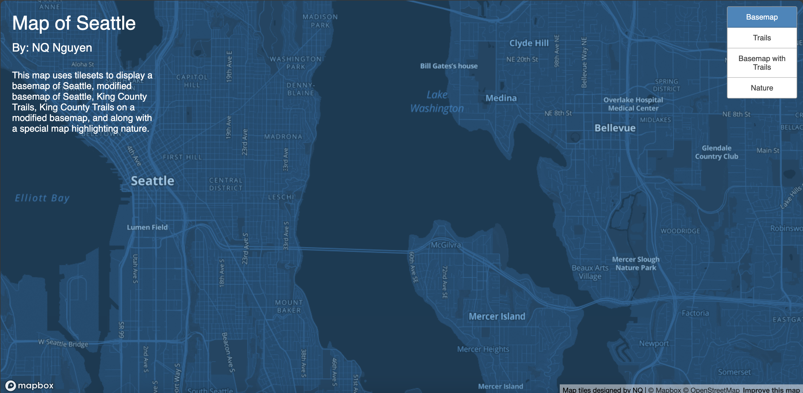
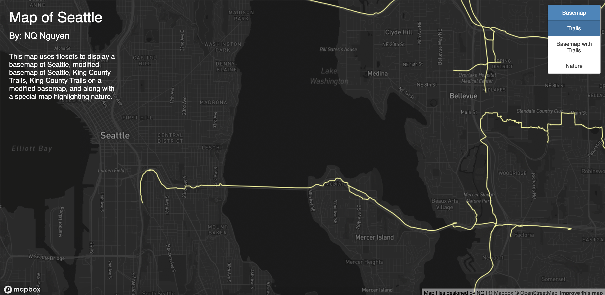
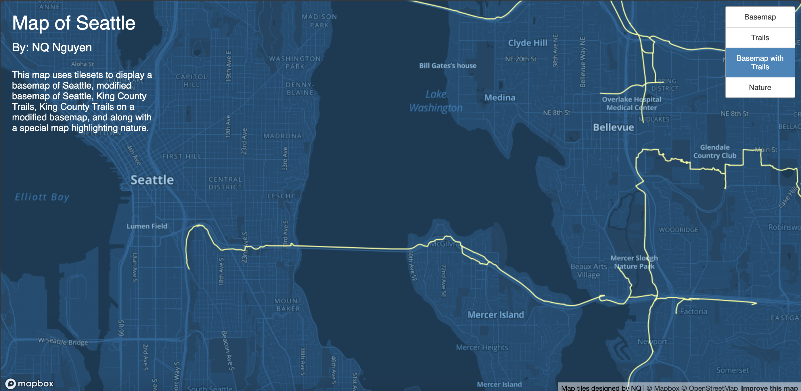
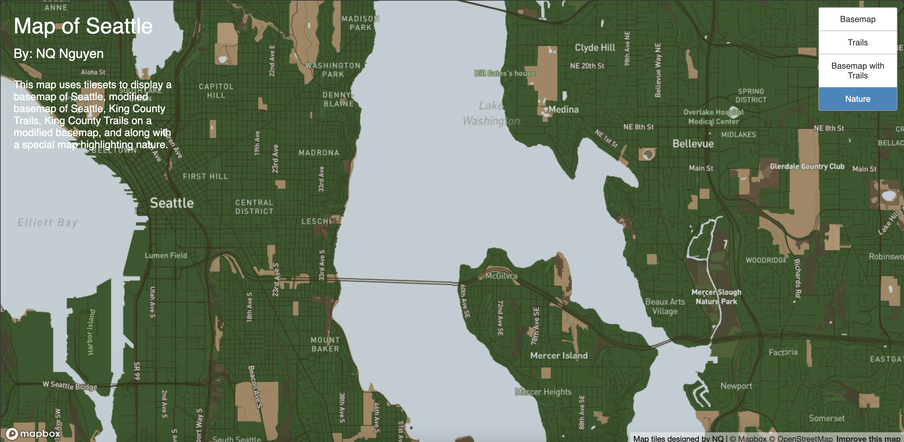

# Mapping with Tilesets
## [Website Link](https://qnn16.github.io/tilesets/)
In this project, I examined the Seattle area as Washington State is known for being a great place for expeditions in nature. \
The four tilesets I used all revolved around King County examining the widely available trails within the region. \
All four tilesets have a minimum zoom of 3 and maximum zoom of 14.
>A special nature-themed map is also included!

> Custom basemap that I created by modifying the colors and font from the default [Mapbox Monochrome Style](https://docs.mapbox.com/studio-manual/guides/map-styling/).  

  

> A map that showcases various trails in King County. Data was collected from [King County GIS Open Data](https://gis-kingcounty.opendata.arcgis.com/datasets/c9ba67806d344c95aedec74c73d0b81e_273/explore?location=47.430889%2C-121.777100%2C10.32).

> Made in combination with the first two tilesets.

> A special tileset created with Mapbox used to highlight the nature aspect of the King County area. I tried my best to highlight the 'outdoors' aspects of Seattle with the color scheme and by minimizing other aspects while trying to maximize details towards greener areas. The reason I picked this topic is because Washington is known for having great places to hike.
